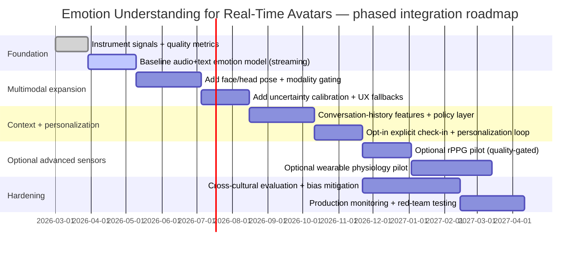

# Improving Real-Time Avatars’ Emotional Understanding and Affective Response

## Executive summary

The provided deck at `https://www.realtime-avatars.com/slides/1` is titled “Real-Time Digital Avatars: A Comparative Analysis” and indicates “1 / 35” slides, but the full slide text beyond the title slide was not machine-extractable via the link during this analysis. citeturn1view0 The “40-slide indexed deck” was not provided in a reachable form in this chat, so all deck-specific inferences beyond the title slide are **unspecified**. citeturn1view0

However, the companion research material on the site and the public repo behind it describe an implementation context that is directly relevant to building an emotion-understanding stack: a real-time avatar system spanning a MetaHuman/Unreal control path, streaming infrastructure via WebRTC/LiveKit, and real-time API routes (including an OpenAI realtime client-secret route). citeturn38view0turn19search0 The site’s survey emphasizes that real-time avatar systems are constrained by latency, controllability, and robustness trade-offs (e.g., “~30–50ms” for a graphics pipeline vs “~100–300ms” for streaming systems, and higher first-frame latency for generative video). citeturn19search0 Those constraints imply that **emotion recognition for real-time avatars must be: (a) causal/streaming, (b) uncertainty-aware, and (c) robust to missing modalities**, because real calls routinely have occluded faces, poor lighting, and noisy audio. citeturn19search0turn26search10

The most effective way to improve emotion understanding **in real time** is usually not a single flashy sensor (e.g., pupil dilation), but a layered approach:

1. **Maximize signal quality from sensors you already have** (mic + camera) with explicit quality metrics and modality-gating.
2. **Add “low-friction, high-value context”** (conversation history, app state, turn-taking, user preferences) to disambiguate ambiguous expressions—because emotion inference from biometrics alone is scientifically and contextually fragile. citeturn32search1turn48search2  
3. **Introduce optional, consent-driven “ground-truth taps”** (a one-tap “how are you feeling?” slider, reaction buttons) to personalize and calibrate, because emotion is both culturally variable and individually idiosyncratic. citeturn32search1turn28search49turn48search9  
4. Use a **streaming multimodal model** (audio + text + face/head/gaze) with **uncertainty estimates** and a response policy that converts uncertain affect into safe, nonpresumptive avatar behaviors. citeturn37search1turn37search0turn46search4turn47search0

Finally, legal and trust constraints are not optional. In the **entity["organization","European Union","supranational union"]**, the AI Act defines “emotion recognition systems” as inference of emotions/intentions from biometric data and explicitly prohibits emotion inference in workplace and education contexts (with limited medical/safety exceptions). citeturn32search1turn48search2 The GDPR defines biometric data as personal data from specific technical processing of physical/physiological/behavioral characteristics enabling unique identification, and restricts processing of special categories including biometric data used for unique identification. citeturn42view0 Even outside those contexts, these laws reflect a broader product reality: **emotion is high-stakes, often ambiguous, and culturally variable**, so the system must communicate uncertainty and avoid overconfident “mind-reading.” citeturn32search1turn48search6turn48search9

## Prioritized input enhancements for better real-time emotion recognition

The table below prioritizes concrete ways to **enrich user input** (signals + context + explicit feedback) to improve emotion recognition and downstream affective response. Prioritization favors: (1) high incremental information, (2) low friction, (3) real-time feasibility, and (4) controllable privacy risk.

**Legend (qualitative):**  
Expected benefit / Privacy risk / Latency impact / Complexity ∈ {Low, Med, High}.  
“Latency impact” refers to incremental impact beyond the baseline voice+avatar pipeline; a well-designed pipeline should keep “emotion-perception” inference within the conversational comfort envelope (e.g., highly interactive tasks are sensitive to relatively low delay). citeturn35search1turn19search0

| Priority | Input enhancement (what to capture) | Rationale (why it helps) | Required sensors / data | Expected benefit | Privacy risk | Latency impact | Implementation complexity |
|---:|---|---|---|---|---|---|---|
| 1 | **Audio prosody features** (pitch/F0 contours, energy, speaking rate, jitter/shimmer, voicing probability) | Prosody carries affect even when semantics are neutral; also robust when face is off-camera. Common in multimodal emotion recognition baselines. citeturn36search4turn37search0 | Microphone; real-time audio frames (e.g., 20–40 ms windows) | High | Med | Low | Med |
| 2 | **Speech content + paralinguistic tokens** (ASR transcript, laughter/sighs/crying, disfluencies, profanity, hedges) | Semantic valence and pragmatic markers disambiguate facial/voice cues; paralinguistic vocalizations are strong affect signals. citeturn36search2turn26search4 | Microphone; streaming ASR; non-speech event detector | High | Med | Med | Med–High |
| 3 | **Conversation history features** (recent turns, sentiment trajectory, topic shifts, interruption patterns) | Many “emotions” are only interpretable in context (e.g., sarcasm, frustration buildup). Conversation-level emotion datasets explicitly show the value of context. citeturn36search2turn36search7 | App logs; transcript; timestamps; diarization/turn-taking | High | Med | Low | Med |
| 4 | **Face expression + action units (AUs)** (FACS-style interpretables) | AUs provide more stable, interpretable, and controllable signals than raw “emotion labels,” and map well to avatar blendshapes. citeturn25search7turn28search2 | Webcam; face landmark + AU estimator | High | High | Med | Med–High |
| 5 | **Head pose + nod/shake + backchannel timing** | Listening behaviors (nods, head tilts) are critical for perceived natural interaction; also helps detect engagement/turn-taking. Real-time avatar surveys emphasize “listening behaviors and timely nods.” citeturn19search0 | Webcam; head pose estimator | Med–High | Med | Low | Low–Med |
| 6 | **Eye gaze direction + blink rate** (attention proxy, social signaling) | Gaze and blink patterns contribute to engagement/involvement cues; can also indicate cognitive load. Cross-cultural variability exists, so should be used as soft evidence + calibrated. citeturn32search1turn48search9 | Webcam; eye landmark/gaze estimator | Med | High | Med | Med |
| 7 | **Camera and audio quality telemetry** (SNR, clipping, reverb; face visibility score; illumination estimate) | Enables **modality gating**: downweight unreliable channels to prevent spurious emotion inferences under noise/occlusion. Real-world physiology-from-video work shows sensitivity to motion/illumination. citeturn26search5turn26search2 | Mic + webcam; cheap signal-quality metrics | High (indirect) | Low | Low | Low |
| 8 | **Body posture + gesture features** (upper body keypoints, self-touch, agitation, expansiveness) | Adds affect evidence when face is masked/occluded; whole-body emotion perception is culturally modulated, so must be calibrated and treated probabilistically. citeturn48search8turn19search0 | Webcam; pose/keypoint estimator; optional depth helps | Med–High | High | Med | Med–High |
| 9 | **Explicit “emotion check-in” micro-UI** (1-tap valence/arousal slider, “I’m ok / stressed / excited”) | Provides consented ground-truth for personalization + calibration; reduces hallucinated affect; aligns with dimensional emotion models (valence/arousal). citeturn28search49turn24search3 | UI input (no extra sensors) | High | Low–Med | Low | Low |
| 10 | **User preference + profile constraints** (opt-in: “don’t mirror sadness,” cultural norms, accessibility needs) | Individual differences are large; profiles reduce harmful mismatches and support culturally sensitive responses. citeturn32search1turn48search9 | User settings and onboarding; no sensors | Med–High | Med | Low | Low |
| 11 | **Environment metadata** (noise classification, “in public,” “driving,” headphones on/off) | Context prevents misreading: loud café vs quiet room changes prosody; “driving” suggests fatigue detection (physical state) rather than emotion. AI Act distinguishes “emotion” from physical states like fatigue. citeturn32search1turn35search1 | Device APIs; user toggle; environment classifiers | Med | Med | Low | Low–Med |
| 12 | **Typing dynamics (desktop/mobile)** (key hold time, latency, error rate) | Typing patterns shift with valence/arousal, though effect size may be small and individualized; useful as auxiliary signal and for personalization. citeturn27search0turn27search2 | Keyboard event timing (opt-in) | Low–Med | High | Low | Med |
| 13 | **Touch/pressure dynamics** (force/area/time series on supported devices) | Touch behavior can encode affect; published results show emotion classification from force-sensitive touches in controlled settings. citeturn27search9 | Force-sensitive touchscreen (limited hardware) | Low–Med | High | Low | Med |
| 14 | **Remote heart rate via rPPG** (camera-based pulse proxy, HRV features) | Adds arousal/stress evidence; but sensitive to illumination and motion; should be gated by quality. citeturn26search5turn26search2 | High-quality webcam; stable lighting; rPPG model | Med | High | High | High |
| 15 | **Wearable physiology (EDA/ECG/temp/respiration)** (optional, explicit consent) | Strong arousal/stress signal; datasets like WESAD and RECOLA demonstrate multimodal affect with EDA/ECG/respiration. citeturn23search7turn24search3 | Wearable device APIs (watch/chest strap) | High | Very High | Med | High |
| 16 | **Micro-expression capture** (high-FPS onset/apex dynamics) | Micro-expressions require high frame rates (often ~100–200 fps) and controlled imaging; not a general consumer webcam feature; high risk/complexity for limited incremental gain. citeturn25search0turn25search7 | High-speed camera + stable lighting | Low–Med | High | High | High |

### Trade-off chart for prioritization (benefit vs privacy risk)

```mermaid
quadrantChart
  title Emotion-sensing input enhancements: benefit vs privacy/consent risk
  x-axis Low privacy risk --> High privacy risk
  y-axis Low expected benefit --> High expected benefit
  quadrant-1 High benefit / High risk
  quadrant-2 High benefit / Low risk (best early)
  quadrant-3 Low benefit / Low risk
  quadrant-4 Low benefit / High risk (avoid early)

  Audio prosody: [0.35, 0.85]
  Speech content+paralinguistics: [0.45, 0.85]
  Conversation context: [0.35, 0.80]
  Quality telemetry: [0.15, 0.70]
  Face AUs: [0.75, 0.85]
  Head pose/nods: [0.45, 0.65]
  Explicit check-in UI: [0.20, 0.75]
  Wearable physiology: [0.95, 0.80]
```

Interpretation: “best early” signals are usually **audio prosody + speech content + conversation context + quality telemetry + an optional explicit check-in**, because they deliver strong incremental information without requiring invasive biometrics or specialized hardware. citeturn36search4turn36search2turn47search0turn32search1

## Recommended multimodal fusion approaches and model types

This section answers: **“What model do we use to generate output?”** by separating (A) emotion inference models and (B) how that inferred affect controls avatar output.

### Emotion inference models

A robust real-time emotion system should output **(1) an affect representation** and **(2) an uncertainty estimate** rather than a single hard label, because both law/regulation and empirical findings emphasize limited reliability and context dependence. citeturn32search1turn48search2 Practically, a good default representation is:

- **Dimensional core affect:** valence ∈ [−1, +1], arousal ∈ [0, 1], optionally dominance ∈ [0,1]. (The circumplex model supports valence/arousal as a compact affect space.) citeturn28search49turn28search1  
- **Auxiliary discrete tags** (optional): {joy, sadness, anger, fear, disgust, surprise, neutral} for UX/animation affordances, but always derived from (valence/arousal + context) and always uncertainty-aware. (These discrete sets have cross-cultural evidence and debate; they’re best treated as “interfaces,” not ground truth.) citeturn29search47turn29search7turn48search6

**Model families (ranked for real-time, multimodal robustness):**

**Streaming multimodal transformer with cross-attention + gating (recommended target).**  
Recent multimodal emotion recognition methods use transformer-based fusion with cross-attention across modalities to handle asynchronous signals and emphasize salient cues (e.g., audio-video cross-attention). citeturn37search6turn37search0 For real-time, you constrain it to causal attention (no future leakage) and include a gating network that conditions on quality metrics.

- Pros: strong fusion capability; handles missing modalities via gating; supports variable-length temporal context. citeturn37search0turn37search6  
- Cons: heavier compute; careful engineering required for streaming. citeturn37search2  

**Uncertainty-aware fusion (recommended, especially for UX safety).**  
Methods like COLD Fusion model modality-wise uncertainty, explicitly quantifying when audio or face is unreliable. citeturn37search1 For real products, this is essential for “don’t overclaim” behavior and to drive safe fallbacks.

- Pros: principled “I’m not sure” signal; supports robust weighting under occlusion/noise. citeturn37search1turn26search10  
- Cons: adds training complexity; calibration must be validated. citeturn47search0  

**Interpretable / structured fusion (good for debugging and compliance).**  
Dynamic Fusion Graph approaches were introduced alongside CMU-MOSEI to model modality interactions and improve interpretability. citeturn36search0 This matters when you must explain “what cues drove the avatar’s emotional response.”

- Pros: interpretability; easier diagnosis of spurious cues. citeturn36search0  
- Cons: can underperform the best deep fusion on some tasks unless tuned. citeturn37search0  

**Low-latency baselines (should exist even if not the final system).**  
A strong engineering pattern is to ship a baseline first: modality-specific encoders + late fusion MLP (or averaging) + temporal smoothing. This is a “control” against which you measure gains from cross-attention. Many published systems combine CNN (fast) + transformer (long context) trade-offs. citeturn37search2turn37search0

- Pros: simplest to deploy; easiest to optimize; resilient to partial feature failure.  
- Cons: weaker cross-modal interaction modeling than cross-attention. citeturn37search6  

### How the model drives avatar output

The deck/survey emphasize that avatar approaches differ in controllability: rig-based pipelines provide fine-grained deterministic control, while generative video has less explicit control and higher latency. citeturn19search0 Therefore, emotion understanding should be converted into **low-dimensional, controllable “behavior primitives”** rather than directly generating pixels.

A practical output control layer:

- **Affect state**: (valence, arousal, confidence, modality-reliability vector). citeturn37search1turn46search4  
- **Dialog act + interaction state**: listening, speaking, thinking, clarifying, empathizing, apologizing, joking. (Derived from conversation + LLM). citeturn36search2turn36search0  
- **Behavior primitives** mapped to avatar controls:
  - facial: AU/expressions → blendshape weights (smile intensity, brow raise, lip press)
  - head: nod frequency/amplitude, tilt
  - gaze: gaze targets and blink rates
  - speech: TTS prosody style, tempo, volume, pauses
  - body: gesture set selection and intensity (if full-body avatar)

This matches the repo context: a control path exists for real-time avatar control and a streaming pipeline exists for delivery. citeturn38view0turn19search0

### Real-time pipeline diagram (signals → emotion → avatar response)

```mermaid
flowchart LR
  U[User] --> A1[Mic audio]
  U --> V1[Webcam video]
  U --> T1[Explicit check-in UI]
  App[App state + conversation history] --> Ctx[Context features]

  A1 --> AP[Audio preprocessing\nVAD, denoise, SNR]
  V1 --> VQ[Video quality\nface visible, lighting]
  V1 --> FV[Face/Head/Gaze features\nAUs, pose, gaze]
  AP --> AF[Prosody + paralinguistics\nF0, energy, laughs/sighs]
  AP --> ASR[Streaming ASR\ntext tokens + timing]
  ASR --> TF[Text/pragmatics\nsentiment, intent, hedges]

  VQ --> Gate[Modality reliability gating]
  AF --> Gate
  TF --> Gate
  FV --> Gate
  Ctx --> Gate
  T1 --> Gate

  Gate --> Fuse[Streaming multimodal fusion\n(causal cross-attn + MoE)]
  Fuse --> Emo[Core affect + uncertainty\n(valence, arousal, conf)]
  Emo --> Policy[Affective response policy\nsafe if uncertain]
  Policy --> Ctrl[Avatar controllers\nface/head/gaze/voice/gesture]
  Ctrl --> Stream[Real-time render/stream]
```

## Data collection and annotation plan

This section addresses “What signal to input from the users?” from a data/ground-truth perspective: you can only improve emotion recognition if you can measure whether you improved it.

### Core data strategy

A pragmatic plan uses **three nested layers of truth**, because “emotion” is not a single objective variable:

1. **Observable behavior labels** (high reliability): facial AUs, head nods, speech prosody events, turn-taking events. (These can be machine-labeled with spot-checking; they’re closer to “what happened” than “what was felt.”) citeturn25search7turn29search47  
2. **Perceived emotion labels** (medium reliability): what observers think the user felt (crowd or trained raters). Many standard datasets use perceived emotion labels. citeturn36search4turn36search2  
3. **Self-report** (most “true” but sparse/noisy): what the user says they felt, ideally as continuous valence/arousal, optionally with short categorical tags. RECOLA-style continuous affect annotation is a strong precedent. citeturn24search3turn24search4

### Labeling schema (recommended)

Use a schema compatible with major benchmarks and with avatar control needs:

- **Continuous valence + arousal** at 2–5 Hz (or per conversational chunk) for modeling dynamics; this aligns with circumplex/core-affect representations. citeturn28search49turn24search3  
- **Discrete emotion** (optional) among 6–8 classes for UX mapping and benchmark comparability (e.g., MELD’s 7). citeturn36search2  
- **Event tags**: laughter, sigh, long-pause, interruption, raised voice, whispering, crying (helps interpret arousal and ambiguity). citeturn26search4turn36search4  
- **Context tags**: topic category, interaction goal, user role (support call vs tutoring), environment (public/private), language/culture codes. citeturn32search1turn24search2

### Collection sources and bootstrapping

Start by training and validating on known multimodal corpora, then adapt with product data:

- **Audio+video+text corpora**:
  - IEMOCAP provides multimodal recordings and is explicitly motivated by joint analysis of speech and gesture. citeturn23search1turn23search8  
  - CMU-MOSEI is a large multimodal dataset with sentiment/emotion and an accompanying fusion method paper. citeturn22search0turn36search0  
  - MELD is conversation-based (multi-party) and highlights context importance. citeturn36search2turn36search7  
  - CREMA-D provides audio-only, video-only, and audio-visual ratings that are useful for modality ablations. citeturn36search4  

- **Physiology corpora** (only if you plan physiology features):
  - RECOLA includes audio/video plus ECG and EDA. citeturn24search3turn24search4  
  - WESAD includes wearable physiological and motion sensors across neutral/stress/amusement. citeturn23search7turn23search3  

- **Cross-cultural corpora**:
  - SEWA includes six cultures and continuous valence/arousal (plus other social signals). citeturn24search2turn24search1  
  - “Many Faces of Anger in the Wild” targets specific cultural differences in anger-related labels. citeturn24search0  

### Quality controls (annotation and dataset shift)

Key controls that materially affect model quality:

- **Inter-rater reliability gates**: compute Krippendorff’s alpha (or weighted variants for ordinal scales) on overlapping samples; reject tasks/raters below thresholds. citeturn43search4turn43search5  
- **Calibration sessions for raters** using “anchor clips” that define what “high arousal” means in your context, similar to how lab corpora constrain annotation. citeturn24search3turn25search7  
- **Hard-negative collection**: deliberately collect confusable states (e.g., excitement vs anxiety; anger vs frustration) because these dominate user-facing errors. (The AI Act itself flags limited specificity and generalisability of emotion inference technologies.) citeturn32search1turn48search2  
- **Privacy-preserving data minimization**: store feature embeddings (and quality metrics) rather than raw audio/video when possible; GDPR principles include data minimisation and purpose limitation. citeturn42view0  

## Evaluation plan with metrics and suggested benchmarks

This section answers “How do we know we improved emotion understanding?” and ties evaluation to real-time constraints.

### Offline metrics (model quality)

Use metrics matched to label type:

- **Discrete emotion classification**: Macro-F1, Unweighted Average Recall (UAR), confusion matrices per culture/language. (Macro measures help with class imbalance common in emotion labels.) citeturn36search2turn36search4  
- **Continuous valence/arousal regression**: Concordance Correlation Coefficient (CCC) because it captures both accuracy and precision; CCC is a standard agreement metric introduced by Lin. citeturn46search4turn46search1  
- **Calibration / uncertainty metrics**: Expected Calibration Error (ECE) and reliability diagrams; Guo et al. show modern nets can be poorly calibrated and temperature scaling can help. citeturn47search0  
- **Robustness metrics**: performance vs controlled degradations (noise SNR bins, face occlusion %, lighting bins) because field conditions differ from benchmarks. rPPG literature shows realistic conditions (movement, low quality, illuminance change) can break naive methods. citeturn26search2turn26search5  

### Real-time system metrics (product constraints)

Because the avatar system is real-time, you must score:

- **End-to-end interaction latency**: measure “user signal → emotion update available” and “emotion update → avatar behavior applied.” ITU guidance notes interactive tasks can be affected by relatively low delays even below 400 ms. citeturn35search1turn19search0  
- **Jitter and stability of affect**: rate-limited updates; oscillation penalties (avoid rapid emotion flips).  
- **Missing-modality resilience**: A/B where camera off, face partially visible, or noisy mic. citeturn26search10turn19search0  
- **Safety/appropriateness**: false positive rate of high-stakes labels (e.g., “anger”) and the rate of “overconfident wrong” outputs, because these are the trust-breaking failures. citeturn32search1turn37search1  

### Benchmark/dataset shortlist for development

A balanced benchmark mix:

- Conversation emotion (context): MELD. citeturn36search2  
- Multimodal large-scale: CMU-MOSEI. citeturn22search0turn36search0  
- Controlled multimodal + motion cues: IEMOCAP. citeturn23search1  
- Continuous affect + physiology: RECOLA. citeturn24search3turn24search4  
- Cross-cultural: SEWA and/or MF-AWild. citeturn24search2turn24search0  
- Facial in-the-wild valence/arousal: Aff-Wild2. citeturn23search0turn37search0  

## UX guidelines for presenting avatar emotions and uncertainty

This section answers “How to perform these outputs?” from the user experience perspective—what the avatar should do when the model is confident vs uncertain.

### Principles

**Prefer “responsive listening” over “emotional diagnosis.”**  
The avatar should prioritize behaviors that are helpful even if emotion inference is wrong: attentive posture, appropriate turn-taking, clarifying questions, and empathetic but non-presumptive phrasing. This aligns with human-centric evaluation in the provided survey (“responsive listening behaviors and timely nods”). citeturn19search0  

**Expose uncertainty as behavior, not as numbers (by default).**  
When uncertainty is high, avoid strong displays (e.g., big smile, exaggerated sadness). Instead: small nods, neutral face, gentle tone, and a clarifying question (“Do you want me to keep it кратко / go deeper?”). Uncertainty-aware fusion work is designed to quantify this uncertainty; you should use it to drive UX. citeturn37search1  

**Separate “expression detection” from “emotion inference” in user messaging.**  
Regulatory text distinguishes between detecting expressions/gestures and inferring emotions/intentions; your UX copy should avoid claiming certainty about internal states. citeturn32search1turn48search2  

### Concrete UI/behavior patterns

- **Affective backchannel policy** (always on): nod timing, “mm-hmm,” short acknowledgements, gaze alignment—driven mainly by turn-taking cues and prosody, not by inferred discrete emotions. citeturn19search0turn36search2  
- **Emotion-aware content policy** (confidence gated):  
  - High confidence “negative valence + elevated arousal” → slow down speech, reduce interruptions, offer choices.  
  - High confidence “positive valence + moderate arousal” → slightly increased expressiveness, playful tone if context allows.  
  - Low confidence → neutral expression + ask for explicit check-in (one-tap). citeturn37search1turn28search49  
- **User controls**:
  - “Emotion sensing: Off / Basic (audio+text) / Enhanced (camera) / Wearable (optional)”  
  - “Store raw media: never / session only / opt-in for improvement” (aligns with data minimization and consent principles). citeturn42view0turn32search1  

### Fallback behaviors (robustness)

- **Camera off / occlusion**: fall back to audio+text; display a subtle indicator that visual cues are unavailable (“Camera cues unavailable—responding to voice/text”).  
- **Noisy audio**: fall back to visual + text; ask user to switch input mode or repeat.  
- **High ambiguity**: use neutral avatar affect and ask a clarifying question rather than guessing (“I may be misreading this—are you feeling frustrated or just focused?”). citeturn37search1turn47search0  

## Phased integration roadmap with effort, milestones, and risk mitigation

This roadmap assumes budget is not constrained (as requested), while acknowledging that device availability, deployment environment, and jurisdiction are unspecified. citeturn1view0turn38view0

### Roadmap overview



### Phase details (milestones, resourcing, risks)

**Foundation: instrumentation + baseline (≈10 weeks; ~2–3 FTE)**  
Milestones:
- Capture audio/video streams plus **quality telemetry** (SNR, face visibility, lighting). citeturn26search2turn26search5  
- Baseline streaming model: audio prosody + ASR text + conversation turn timing (late fusion).  
- Baseline avatar behavior: backchanneling and “neutral-safe” affect.

Key risks and mitigations:
- *Risk:* “Emotion” labels too noisy. *Mitigation:* represent affect in valence/arousal + confidence; start with check-in UI for sparse ground truth. citeturn28search49turn37search1  
- *Risk:* latency bloat. *Mitigation:* causal inference; lightweight encoders; measure end-to-end latency; keep within interactive comfort range. citeturn35search1turn19search0  

**Multimodal expansion: face/head + uncertainty (≈14 weeks; ~3–5 FTE)**  
Milestones:
- Add face AUs + head pose; implement **modality gating** based on quality.  
- Add uncertainty estimation and calibration (ECE; temperature scaling). citeturn47search0turn37search1  
- UX fallbacks tied to uncertainty.

Key risks:
- *Risk:* privacy backlash and regulatory misalignment. *Mitigation:* explicit consent tiers; local/on-device feature extraction where possible; avoid workplace/education uses where prohibited under EU AI Act. citeturn32search1turn48search2  

**Context + personalization (≈14 weeks; ~3–4 FTE)**  
Milestones:
- Conversation-history features (emotion trajectory, repair patterns).  
- Personalization using explicit signals (check-ins, user preferences), improving auxiliary signals such as typing dynamics where available. citeturn27search0turn36search2  

Key risks:
- *Risk:* model learns spurious user-specific proxies. *Mitigation:* privacy-preserving personalization (on-device, federated approaches if applicable); strict feature governance. citeturn42view0  

**Optional advanced sensors (parallel pilots; high risk)**  
- rPPG pilot only if you can guarantee stable camera conditions; literature shows sensitivity to illumination changes and missing face regions. citeturn26search5turn26search10  
- Wearables pilot if your product domain strongly benefits from stress/arousal detection; WESAD and RECOLA demonstrate feasibility but also highlight that physiology collection is inherently sensitive. citeturn23search7turn24search3  

**Hardening: cross-cultural + monitoring (≈20 weeks; ~4–6 FTE)**  
Milestones:
- Evaluate across cultures (SEWA; targeted cultural datasets). citeturn24search2turn24search0  
- Bias audits and “do no harm” metrics; model cards and data governance.  
- Continuous monitoring: calibration drift, modality dropouts, and user-reported misreads.

Key risks:
- *Risk:* systematic cultural misinterpretation (e.g., performance differs by cultural match, and audiovisual emotion recognition shows nationality/culture effects). citeturn48search6turn48search9  
- *Mitigation:* culture-aware evaluation splits + optional user calibration (“how do you usually show frustration?”) and conservative response policy when uncertain. citeturn32search1turn37search1

## Skill Conclusion: Multimodal Inputs/Outputs by Approach

- Updated at (UTC): `2026-02-19T23:22:42Z`
- Multimodal cycle: `42`
- Research source cycle: `19`

### Cross-method summary

| Approach | Identity representation | Typical realtime inputs | Typical realtime outputs |
|---|---|---|---|
| MetaHuman | DNA + RigLogic + blendshape rig | face video, audio, head pose, gaze, turn cues | ARKit curves, head/eye transforms, rendered UE stream + speech |
| Video Generation | identity latent tokens in diffusion/DiT stack | audio, text intent, optional pose/emotion controls | synthesized video frames + optional speech track |
| Gaussian Splatting | explicit 3D Gaussian primitives (+ optional rig) | audio, expression coeffs, pose, gaze, optional text intent | realtime splat-rendered frames + speech |

### MetaHuman: how multimodal I/O works

1. Identity creation
- Inputs: MetaHuman Creator parameters, scans/photos via Mesh to MetaHuman, and material/groom assets.
- Models: DNA + RigLogic calibration and rig assembly in Unreal.
- Representation: explicit skeletal mesh, blendshape curves, DNA-backed facial rig.
2. Realtime response model
- Perception path: Live Link Face / MetaHuman Animator derive facial curves and pose from video+audio.
- Behavior path: agent text intent can modulate expression/gaze/turn-taking policy before render.
- Output path: deterministic Unreal render stream plus synchronized voice/audio.
3. Runtime representation: Deterministic rig controls with explicit facial coefficients and bone transforms.
4. Supported coupling patterns
- No native coupling pattern identified.

### Video Generation: how multimodal I/O works

1. Identity creation
- Inputs: single portrait or short reference clip, optional style/persona prompt.
- Models: reference encoders (identity tokens) + temporal conditioning stack.
- Representation: latent identity embeddings conditioned into diffusion/DiT decoders.
2. Realtime response model
- Perception path: audio waveform, text intent, and optional pose/control tokens.
- Behavior path: temporal generators produce coherent motion and lip-sync in latent space.
- Output path: pixel-space video frames with optional separate synthesized speech track.
3. Runtime representation: Implicit latent dynamics decoded to pixels; less explicit geometric control.
4. Supported coupling patterns
- No native coupling pattern identified.

### Gaussian Splatting: how multimodal I/O works

1. Identity creation
- Inputs: multiview capture or one-shot portrait with reconstruction priors.
- Models: 3DGS optimization or feed-forward regressors for splat parameters.
- Representation: explicit 3D Gaussians (position, covariance, opacity, SH color).
2. Realtime response model
- Perception path: audio, expression coefficients, head pose, gaze, optional text/emotion intent.
- Behavior path: audio-to-expression and deformation drivers update splat/rig state.
- Output path: realtime splat rasterization to RGB frames and stream transport.
3. Runtime representation: Explicit neural primitives with fast rasterization and high-fps rendering.
4. Supported coupling patterns
- No native coupling pattern identified.

### Evidence pointers (sample)

- Epic MetaHuman docs: MetaHuman Animator, Live Link, Audio Source animation
- arXiv: LivePortrait, LiveTalk, Avatar Forcing, TaoAvatar, GaussianAvatars, GazeGaussian, ICo3D
- GitHub: livekit/agents, KwaiVGI/LivePortrait, graphdeco-inria/gaussian-splatting
